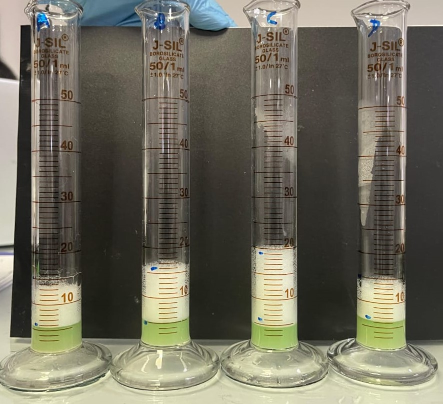

# My E-Portfolio

This e-Portfolio was developed as part of the **SC1172: Introduction to Information Technology** module.

## About Me
I am an undergraduate student who follow Bachelors of Science in Biotechnology 

## Technologies Used
- HTML
- CSS
- Markdown
- GitHub Pages

## Purpose
The purpose of this portfolio is to showcase my academic background, skills, and interests as part of my coursework.

